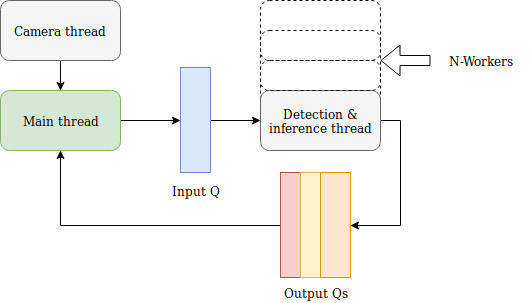
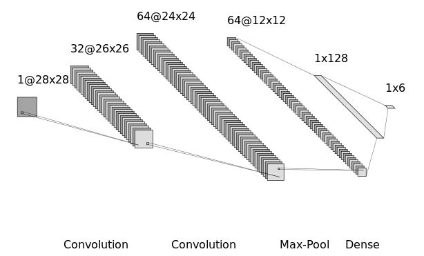

# HandPose

[✔ WORKING]  
*(See the [TODO](##TODO) list below for future improvements)*

A program to recognize hand pose from an RGB camera.

## Getting Started

These instructions will help you setting up the project and understanding how the software is working. You'll see the file structure and what each file does. 

### Requirements
See the *requirements.txt* file or simply run:

    pip install -r requirements.txt

### File structure
.  
├── cnn &nbsp;&nbsp;&nbsp;&nbsp;&nbsp;&nbsp;&nbsp;&nbsp;&nbsp;&nbsp;&nbsp;&nbsp;&nbsp;&nbsp;&nbsp;&nbsp;&nbsp;&nbsp;&nbsp;&nbsp;&nbsp;&nbsp;&nbsp;&nbsp;&nbsp;&nbsp;&nbsp;&nbsp;&nbsp;&nbsp;&nbsp;&nbsp;&nbsp;&nbsp;&nbsp;&nbsp;&nbsp;&nbsp;&nbsp;&nbsp;&nbsp;&nbsp;&nbsp;&nbsp;&nbsp;**Contains the cnn architecture and the models.**  
│   &nbsp;&nbsp;&nbsp;&nbsp;&nbsp;&nbsp;└── models              &nbsp;&nbsp;&nbsp;&nbsp;&nbsp;&nbsp;&nbsp;&nbsp;&nbsp;&nbsp;&nbsp;&nbsp;&nbsp;&nbsp;&nbsp;&nbsp;&nbsp;&nbsp;&nbsp;&nbsp;&nbsp;&nbsp;&nbsp;&nbsp;&nbsp;&nbsp;&nbsp;&nbsp;&nbsp;&nbsp;**Trained models.**  
├── Dataset  
├── Examples  
├── hand_inference_graph  
├── model-checkpoint  
├── Poses &nbsp;&nbsp;&nbsp;&nbsp;&nbsp;&nbsp;&nbsp;&nbsp;&nbsp;&nbsp;&nbsp;&nbsp;&nbsp;&nbsp;&nbsp;&nbsp;&nbsp;&nbsp;&nbsp;&nbsp;&nbsp;&nbsp;&nbsp;&nbsp;&nbsp;&nbsp;&nbsp;&nbsp;&nbsp;&nbsp;&nbsp;&nbsp;&nbsp;&nbsp;&nbsp;&nbsp;&nbsp;&nbsp;&nbsp;&nbsp;&nbsp;&nbsp;&nbsp;**The poses dataset. Each pose will have its folder.**  
│   &nbsp;&nbsp;&nbsp;&nbsp;&nbsp;&nbsp;├── Fist  
│   &nbsp;&nbsp;&nbsp;&nbsp;&nbsp;&nbsp;├── Four  
│   &nbsp;&nbsp;&nbsp;&nbsp;&nbsp;&nbsp;├── Garbage  
│   &nbsp;&nbsp;&nbsp;&nbsp;&nbsp;&nbsp;├── Palm  
│   &nbsp;&nbsp;&nbsp;&nbsp;&nbsp;&nbsp;├── Rock  
│   &nbsp;&nbsp;&nbsp;&nbsp;&nbsp;&nbsp;└── Startrek  
├── protos
├── Results  
└── utils  

### Running the hand pose recognition

To run the multithreaded hand pose recognition, simply run:

    python HandPose.py

### Adding a new pose

To add a new pose, launch the *AddPose.py* script doing:

    python AddPose.py

You will then be prompted to make a choice. Type '1' and 'enter'. Now you can enter the name of your pose and validate with 'enter':

    Do you want to :
        1 - Add new pose
        2 - Add examples to existing pose
        3 - Add garbarge examples
    1

    Enter a name for the pose you want to add :
    Example

    You'll now be prompted to record the pose you want to add.
                 Please place your hand beforehand facing the
                 camera, and press any key when ready.
                 When finished press 'q'.

Place your hand facing the camera, doing the pose you want to save and press enter when ready. You'll see the camera feed. Move your hand slowly across the frame, closer and further from the camera. Try to rotate a bit your pose. Do every movement slowly as you want to create ghosting.  
You can record for as long as you want, but remember that *camera_fps x seconds_of_recording* images will be generated.  

See an example below:

Then you want to head to the new pose folder situated in *Poses/name_of_your_pose/name_of_your_pose_1* and manually delete images that doesn't show well your hand pose.   

*You can optionnally bulk rename them once you finished cleaning but note that it's not required.*

Once that is done you want to normalize those newly created images. Launch *normalize.py* with:

    python normalize.py

This script will go to the poses folder and make sure every images is the right size. It will skip those that are already 28x28. 

You then have to retrain the network. For that, open the file situated in '*cnn/cnn.py*' and edit the hyperparameters and the model file name if needed. The saved model will be situated in '*cnn/models/*'

You don't have to specifiy the number of classes, it will be infered from the number of directories under '*Poses/*'.

Launch the training with:

    python cnn/cnn.py

### Adding garbage examples

Garbage examples are examples where you face the camera and don't do any special hand pose. You want to show your hand, move them around, but don't do any of your poses. The goal is for the SSD to detect some hands and also some false positives. This will generate images that aren't any pose, they are garbage. We do that because we don't want our CNN to missclasify every time a hand is seen.  

Launch the *AddPose.py* script doing:

    python AddPose.py

You will then be prompted to make a choice. Type '3' and 'enter'.

    Do you want to :
        1 - Add new pose
        2 - Add examples to existing pose
        3 - Add garbarge examples
    3
    You'll now be prompted to record the pose you want to add.
                 Please place your hand beforehand facing the
                 camera, and press any key when ready.
                 When finished press 'q'.

Same thing as before, press 'enter' to start the recording and stop with 'q'. Then normalize and relaunch training.
## Architecture

### Pipeline

The pipeline of this project consists of 4 steps :

- A frame is grabbed from the camera by a dedicated thread, converted to RGB (from BGR) and put into the input queue
- A worker grabs the frame from the queue and pass it into the SSD. This gives us a bouding box of where the hand(s) is and the corresponding cropped frame. 
- This cropped frame of the hand is then passed to the CNN, which give us a class vector output of values between 0 and 1. These values correspond to the probability of the frame to be one of the classes. The worker has finished its job and put: the frame with bouding box drawn on top, the cropped frame and the classes into three different queues.
- The main thread, responsible of showing the results can grab the informations from the queues and display them in three windows.

### CNN architecture
  
Input image 28x28x1 (grayscale). Two convolutionnal layers with ReLu activation and kernel size 3, followed by a 2x2 max pooling. Finally a 128 dense layer followed by a softmax layer to give the 6-classes prediction.

### SSD architecture

For more information on the SSD, head to the [references](###References)

## Performance

With 4 workers, I achieved 25fps on a intel i5-8300H running @4Ghz. 

## TODO
- ⌛ Improve hand detection of the SSD
- ✔ ~~Add instructions for garbage pose~~
- ✔ ~~Update file structure~~
- ✔ ~~Generate requirements.txt~~
- ✔ ~~Clean imports~~
- ✔ ~~Add explanations on the pipeline~~
- ✔ ~~Remove garbage as a choice when adding more example to existing pose~~
- ✔ ~~Add SSD architecture~~
- ✔ ~~Add NN architecture~~
- ✔ ~~Understand why multithreading doesn't work on linux~~
- ✔ ~~See if Keras is the right version (Windows and Linux)~~
- ✔ ~~Fix multi-threaded detection~~
- ✔ ~~Add more examples to each gesture~~
- ✔ ~~Add interface to live see inference from network~~
- ✔ ~~Test model~~
- ✔ ~~Tweak training/structure of CNN~~

## Author

* **Victor MEUNIER** - *HandPose* - [MrEliptik](https://github.com/MrEliptik) - [victormeunier.com](http://victormeunier.com) - [blog.victormeunier.com](http://blog.victormeunier.com) - [victormeunier.dev@gmail.com](mailto:victormeunier.dev@gmail.com)

### References

* **Victor Dibia** - *Real-time Hand-Detection using Neural Networks (SSD) on Tensorflow, (2017)*  
GitHub repository, https://github.com/victordibia/handtracking

## License

This project is licensed under the MIT License - see the [LICENSE](LICENSE) file for details
